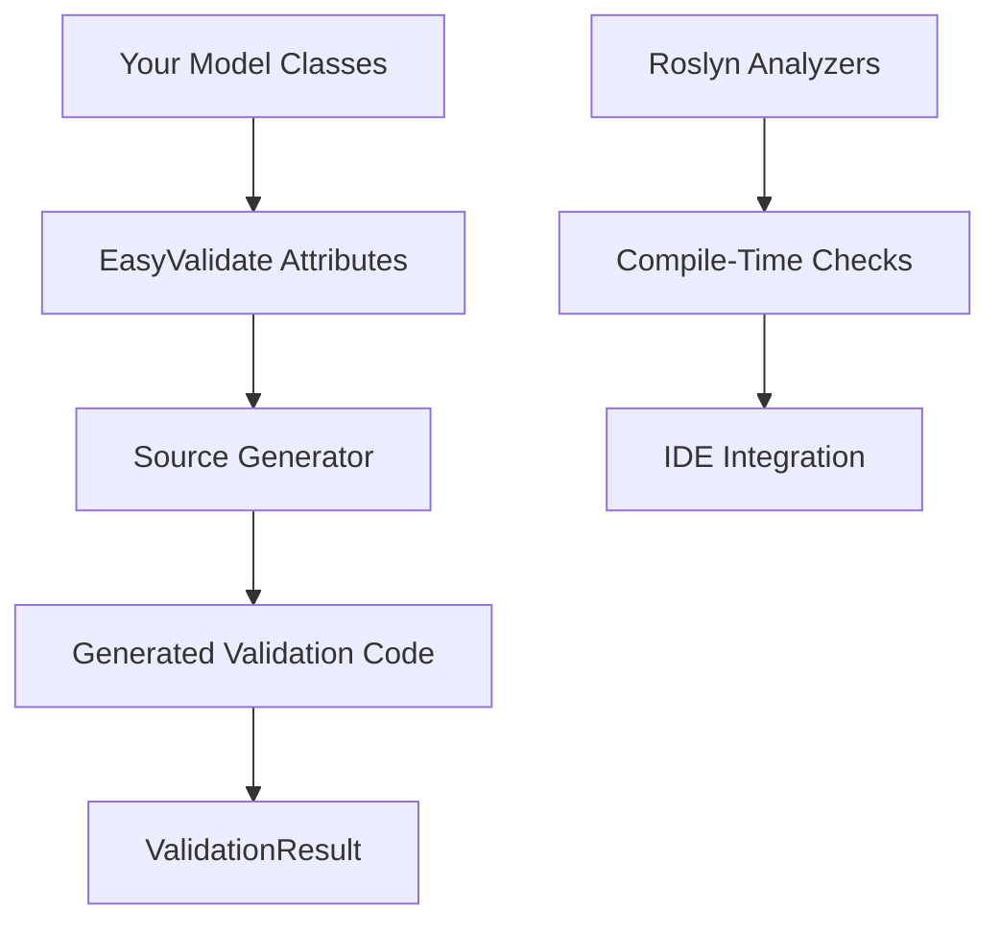

# EasyValidate

EasyValidate is a modern, high-performance, and extensible attribute-based validation library for .NET. Built with source generators and Roslyn analyzers, it provides compile-time validation generation with zero reflection overhead.

## 🚀 Key Features

### Performance-First Design
- **Source Generators**: Validation code is generated at compile-time, eliminating reflection overhead
- **Zero Runtime Cost**: No performance penalty compared to hand-written validation code
- **Memory Efficient**: Minimal allocations during validation

### Developer Experience
- **Attribute-Based**: Clean, declarative validation using attributes
- **Compile-Time Safety**: Roslyn analyzers catch validation errors during development
- **IntelliSense Support**: Full IDE integration with auto-completion and error detection
- **Minimal Configuration**: Works out of the box with sensible defaults

### Comprehensive Validation
- **Rich Attribute Set**: 30+ built-in validation attributes
- **String Validation**: Length, format, regex, email, phone, URL validation
- **Numeric Validation**: Range checks, comparisons, mathematical constraints
- **Date Validation**: Date ranges, relative dates, business day validation
- **Collection Validation**: Array and list validation with custom rules
- **Custom Attributes**: Easy extension with your own validation logic

### Enterprise Ready
- **Localization Support**: Multi-language error messages
- **Dependency Injection**: Full DI container integration
- **Logging Integration**: Structured logging for validation events
- **Thread-Safe**: Concurrent validation without issues

## 🎯 Why Choose EasyValidate?

### vs. FluentValidation
- **Better Performance**: No reflection, compile-time generation
- **Cleaner Code**: Attribute-based approach is more readable
- **IDE Integration**: Better IntelliSense and compile-time checks

### vs. DataAnnotations
- **More Attributes**: Comprehensive validation library
- **Better Error Messages**: Detailed, customizable error information
- **Source Generation**: No reflection overhead

### vs. Manual Validation
- **Consistency**: Standardized validation across your application
- **Maintainability**: Centralized validation logic
- **Testability**: Built-in testing support

## 🏗️ Architecture Overview



EasyValidate uses a multi-layered architecture:

1. **Attribute Layer**: Declarative validation rules on your models
2. **Source Generation Layer**: Compile-time code generation for optimal performance
3. **Analyzer Layer**: Compile-time validation of your validation rules
4. **Runtime Layer**: Fast validation execution with detailed results

## 🔧 Quick Example

```csharp
using EasyValidate.Attributes;

public partial class User
{
    [Required(ErrorMessage = "Name is required")]
    [StringLength(50, MinimumLength = 2)]
    public string Name { get; set; }
    
    [Required]
    [Email]
    public string Email { get; set; }
    
    [Range(18, 120)]
    public int Age { get; set; }
}

// Usage
var user = new User { Name = "John", Email = "invalid-email", Age = 15 };
var result = user.Validate();

if (!result.IsValid())
{
    foreach (var error in result.Errors)
    {
        Console.WriteLine($"{error.Key}: {error.Value.First().Message}");
    }
}
```

## 📚 Documentation Structure

- **[Quick Start](quickstart.md)**: Get up and running in 5 minutes
- **[Installation](installation.md)**: Detailed installation instructions
- **[Attributes](attributes.md)**: Complete reference of all validation attributes
- **[Extending](extending.md)**: Creating custom validation attributes
- **[Analyzers](analyzers.md)**: Understanding compile-time analysis
- **[Localization](localization.md)**: Multi-language error messages
- **[Contributing](contributing.md)**: How to contribute to the project

## 🌟 Getting Started

Ready to get started? Head over to our [Quick Start Guide](quickstart.md) to begin using EasyValidate in your project.

---

**Links**: [GitHub](https://github.com/your-org/EasyValidate) · [NuGet](https://www.nuget.org/packages/EasyValidate) · [Issues](https://github.com/your-org/EasyValidate/issues)
